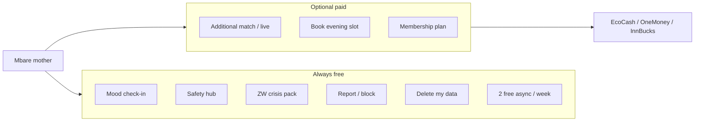
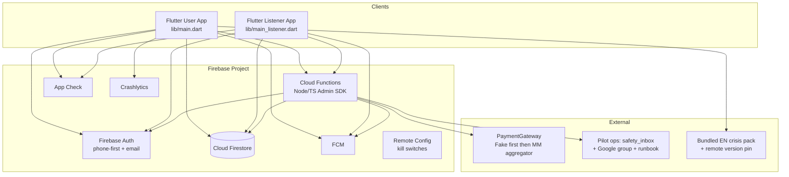
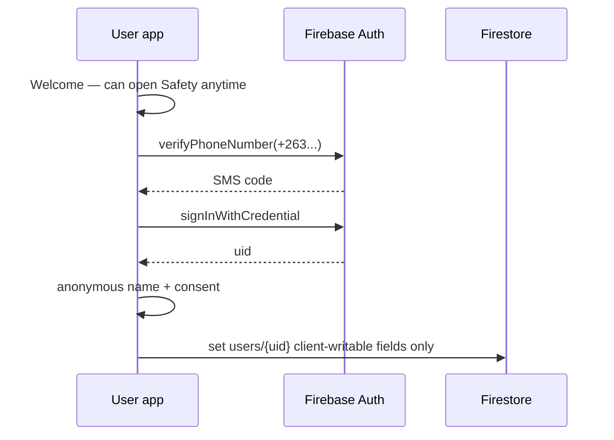
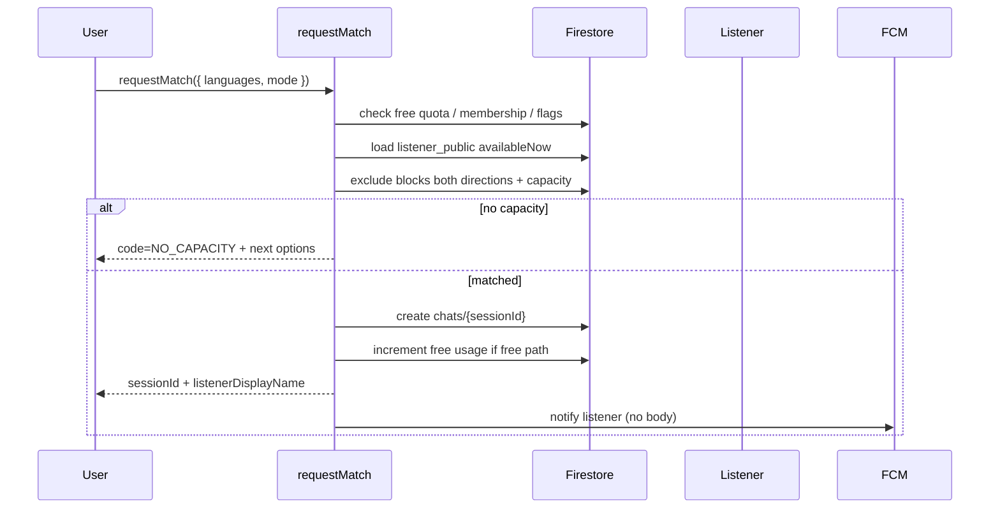
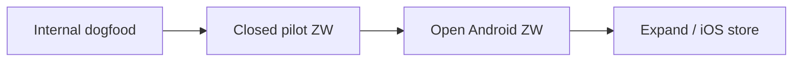

# Production Scale of emo_sup for Vulnerable Communities

| Field | Value |
|-------|--------|
| **Document title** | Production scale of emo_sup for vulnerable communities |
| **Author** | TBD (systems / product eng) |
| **Date** | 2026-07-18 |
| **Status** | Ready for implementation (review approved) (rev 3 — re-review leftovers closed) |
| **Repo** | `/Users/taku/workspace/emo_sup` |
| **Related** | [`docs/firestore_schema.md`](/Users/taku/workspace/emo_sup/docs/firestore_schema.md), [`firestore.rules`](/Users/taku/workspace/emo_sup/firestore.rules), [`AGENTS.md`](/Users/taku/workspace/emo_sup/AGENTS.md) |

---

## Overview

emo_sup is a confidential emotional-support and companionship app that connects end-users with **trained human listeners** over 1:1 text chat and scheduled sessions. It is **explicitly not therapy, not medical care, and not emergency/crisis clinical care**. The current codebase is a Flutter click-through prototype: five MVP screens, anonymous onboarding, in-memory `*Store` classes, partial Firebase Auth wiring, demo payments (including EcoCash / NetOne / InnBucks stubs), and a finalized Firestore schema sketch with deployable rules.

This document defines the path from that prototype to a **production system aimed at vulnerable communities**, starting with Zimbabwe-first constraints (time poverty, low home privacy, intermittent connectivity, cheap Android, mobile-money payments, local languages and crisis resources). The proposed architecture extends the existing Flutter + Firebase shape with **Cloud Functions, FCM, App Check, Crashlytics, a repository layer over Firestore, server-side matchmaking/booking/payment settlement, and honesty-first privacy UX** (including replacing the chat **“Encrypted”** label with accurate copy such as **“Private conversation”** until real E2E exists — the Safety hub already partially discloses that the prototype cue is visual only).

**Rev 2** closed production gaps from the first design review (server-only bookings, payments Phase A/B, Safety enforcement, delete/crisis gates, sequences, CI, offline model, ACLs, free-match policy, listener claims, ops, async, PR MVP cut).

**Rev 3** closes re-review leftovers: free-match **quota store schema**, single **delete unlink** strategy, **CF-authoritative block message reject**, **availability subcollection rules**, booking state machine **plan/sponsored edges**, PR 9 vs PR 13 wording, Pilot MVP cut blurb order.

---

## Background & Motivation

### Current state (prototype)

| Area | Reality today | Path implied in code |
|------|----------------|----------------------|
| UI | 5 MVP screens + separate listener entry (`lib/main.dart`, `lib/main_listener.dart`) | Keep scope; deepen reliability |
| Data | In-memory: `lib/data/chat_store.dart`, `booking_store.dart`, `mood_store.dart`, `membership_store.dart`, `listener_dashboard_store.dart` | Comments already sketch Firestore paths |
| Auth | `AuthService` + `FirebaseAuthService` / `PrototypeAuthService`; profile in memory (`AuthController`) | `users/{uid}` write noted in `completeOnboarding()` |
| Firebase deps | `firebase_core`, `firebase_auth` only (`pubspec.yaml`) | Add Firestore, Functions, FCM, App Check, Crashlytics (product OK required per AGENTS.md) |
| Schema / rules | `docs/firestore_schema.md`, `firestore.rules`, `firestore.indexes.json` | Close open items (listener_public, CF creates); **also** lock down bookings writes |
| Payments | `PaymentService` demo-only; methods: card, ecocash, netone, innbucks | Server ledger + fake gateway first; real MM after commercial choice |
| Safety | Local report/delete stubs on `SafetyPrivacyScreen`; generic crisis placeholders | Real reports + ZW EN crisis pack (validated); sn/nd after partner review |
| Crypto honesty | Chat app bar label **“Encrypted”**; Safety body admits prototype cue / no full E2E | Ship **“Private conversation”** until real E2E |

### Pain points for production / ZW scale

1. **No durable data** — chats, bookings, moods, membership vanish; cannot operate multi-device or multi-party sessions.
2. **Client-trusted assignments** — chat create allows client-supplied `listenerId` (`firestore.rules`); schema already flags CF matchmaking as preferred.
3. **Client-trusted bookings** — rules allow create with `status in ['pending','confirmed']`, so clients can invent confirmed bookings and skip payment.
4. **Open listener list** — `allow list: if signedIn()` on `listeners/{id}` is pre-scale only.
5. **Demo payments** — PIN/`4242` heuristics; no settlement, webhooks, or refunds.
6. **Crisis resources are generic** — 911-style copy; Mbare mothers need Zimbabwe-local, offline-capable packs **after legal validation**.
7. **UI overclaims privacy** — label **“Encrypted”** without real E2E (Safety body is partially honest; chat chrome is not).
8. **Listener languages** — seed data uses EN/ES/FR/Mandarin; ZW needs **English / Shona / Ndebele**.
9. **Phone auth secondary** — credential screen defaults to email (`_AuthMode.email`); ZW users are phone-first.
10. **No offline / discreet mode** — home privacy and intermittent networks are first-class product constraints, not polish.
11. **No pre-auth Safety entry** — Welcome → credential → name → consent has no crisis/safety deep link today.

### Primary persona: mother in Mbare

A mother who runs a small business (market / informal trade), then returns to children and possibly a partner. She has:

- **Time poverty** — 5–15 minute windows between market and home; sessions must be short or async.
- **Low privacy at home** — shared phones/rooms; needs discreet UI, PIN/app lock, **no message body in notifications**.
- **Intermittent connectivity** and a **cheap Android** handset.
- **Scarce money** — EcoCash / NetOne OneMoney / InnBucks first-class; free safety path always; optional NGO/sponsor free slots.
- **Local languages** — Shona, Ndebele, English.
- **Trust over features** — confidentiality, clear non-therapy positioning, reachable safety tools.

---

## Product Positioning Guardrails

These are **hard product and engineering constraints**. Implementers must not drift. See **Appendix C** for the PR review checklist.

### What we are

- Confidential **emotional support and companionship** with **trained human listeners**.
- Anonymous identities only (e.g. “Quiet River”, “Listener — Harbor”).
- Private 1:1 text chat + scheduled text sessions.
- Always-available **Safety & Privacy hub** (crisis resources, report/block, delete-my-data).

### What we are not (forever unless product explicitly reopens)

| Out of scope | Why |
|--------------|-----|
| Therapy / clinical care / diagnosis | Legal, ethical, and AGENTS.md hard guardrail |
| Emergency / crisis clinical service | Safety hub **routes out** to real-world help; we do not treat |
| Video calls | Bandwidth, privacy, scope |
| AI chatbot / AI diagnosis | Trust, liability, out of scope |
| Social feeds, public forums, community | Anonymity and safety model break |
| Gamification (badges, streaks, points) | Inappropriate for vulnerable users |

### Copy & UX rules (enforce in review)

- Never use: “therapist”, “patient”, “treatment”, “diagnose”, “heal your depression”, clinical outcome claims.
- Listener-facing strings: “Never diagnose. Escalate if risk of harm.” (already in `chat_screen.dart` / listener dashboard).
- Consent remains explicit (`ConsentScreen`): not therapy, not medical, not emergency.
- Safety hub **never gated** by onboarding completion, paywall, membership tier, feature flags, or offline “upgrade” walls.
- Report & block and Delete my data remain **≤2 taps** via `SafetyQuickAccessBar` and app bars (**post-auth**). **Pre-auth**: crisis pack + Safety overview reachable from Welcome/Auth (see enforcement below).
- Prefer **“Private conversation”** / **“Private & confidential”** until real E2E ships; do not market “end-to-end encrypted” or bare **“Encrypted”** as if crypto E2E exists (`docs/firestore_schema.md` §3).

### Free safety path — product rule

Crisis resources, report/block, and delete-my-data **must work for unpaid / free-tier users**. Paid sessions and memberships never gate safety.

### Safety always free — technical enforcement

This is not only copy; it is a **routing, flags, and test** contract.

#### Route table

| Context | Crisis pack (offline OK) | Safety overview | Report / block | Delete my data |
|---------|--------------------------|-----------------|----------------|----------------|
| **Pre-auth** (Welcome, credential, name, consent) | **Yes** — app bar / footer “Safety” → `SafetyPrivacyScreen` (crisis + overview; report/delete show “sign in to continue” for write actions only) | **Yes** | Sign-in required to submit | Sign-in required |
| **Post-auth free tier** | Yes | Yes | Yes | Yes |
| **Post-auth paid / membership** | Yes | Yes | Yes | Yes |
| **Offline** | Yes (bundled pack) | Yes (cached shell) | Queue or fail soft with retry; never hide entry | Same |
| **Kill-switch degraded** (`match`/`payments`/`bookings` off) | **Always on** | **Always on** | **Always on** | **Always on** |

#### Remote Config / flag allowlist

| Flag | May disable? | Notes |
|------|--------------|--------|
| `match.enabled` | Yes | Empty-state → booking + crisis, not paywall-only |
| `bookings.enabled` | Yes | Still show Safety |
| `payments.mobile_money` | Yes | Sponsored/free paths if any; Safety untouched |
| `membership.enabled` | Yes | — |
| `safety.hub_enabled` | **Never** — do not ship this flag | Hard-coded always available |
| `crisis.pack_enabled` | **Never** | Pack loader always tries bundled asset |

**Implementation rules:**

1. No `hasActivePlan` / membership check may wrap `SafetyPrivacyScreen`, `SafetyQuickAccessBar`, crisis loader, or Welcome Safety link.
2. Auth flow (`WelcomeScreen`, `AuthCredentialScreen`, `DisplayNameScreen`, `ConsentScreen`): add persistent **Safety** text button → `SafetyPrivacyScreen(initialSection: crisisResources)` without completing onboarding.
3. `Navigator` for Safety must not require `AuthController.profile != null`.
4. Report/delete write paths require auth; UI remains visible with clear next step.

#### Required tests (PR acceptance)

- Widget: Welcome → open Safety → crisis section visible **without** signed-in profile.
- Widget: free-tier Home → Report & block and Delete my data ≤2 taps.
- Widget/integration: `match.enabled=false` → Home still opens Safety; no upgrade wall blocking hub.
- Integration: signed-in free user can create report doc (emulator) and invoke delete callable (stub OK).
- Golden/path: kill switches do not remove Safety entry points.

---

## Mbare-Mother UX Constraints

Design and implement every production feature against these constraints:

| Constraint | Product implication |
|------------|---------------------|
| **Time poverty** | Home CTA → match in ≤3 taps; support **async chat** (message and leave); default booking slots include **evening CAT** (e.g. 19:00); session length guidance 15–30 min text, not hour-long “therapy” framing. |
| **Low privacy** | **Discreet mode**; **app lock PIN/biometrics**; notifications: title only — **never** chat body; pilot default: previews off. Shared handset: one primary account + clear sign-out (no multi-profile v1). |
| **Intermittent network** | Firestore offline persistence + **client-generated message ids** (single writer — no dual custom outbox in v1); clear `sending` / `failed` + retry. |
| **Cheap Android** | See **§12 Performance targets**; minSdk 23; measure on 2–3 GB RAM devices before open enrollment. |
| **Scarce money** | Mobile money first-class; **2 free async sessions/week** pilot default; sponsored slots; Safety always free. |
| **Languages** | UI i18n: `en` first, `sn`/`nd` progressive; crisis **EN pack only** until partner-reviewed sn/nd. |
| **Trust** | Honest crypto copy; one primary action per screen (AGENTS.md). |



---

## Goals & Non-Goals

### Goals

1. **Production backend** on Firebase: Firestore, Auth (phone-first), Cloud Functions, FCM, App Check, Crashlytics.
2. **Repository layer** replacing in-memory stores with Firestore-backed implementations behind stable interfaces; stores remain UI-facing ChangeNotifiers.
3. **Server-authoritative** matchmaking, **booking** create/status/payment fields, payment settlement, delete-my-data, escalation.
4. **ZW mobile money path**: ledger + webhook + `PaymentGateway` with **fake/sandbox first**; real provider as follow-on after commercial choice.
5. **Safety pipeline**: real reports, blocks, CF data deletion, **validated EN** Zimbabwe crisis pack (sn/nd gated).
6. **Privacy UX**: discreet mode, app lock, private notifications; honest confidentiality labels.
7. **i18n** progressive: en complete for pilot UI; sn/nd for product chrome when copy owned; crisis sn/nd only after partner review.
8. **Listener ops**: vetting → custom claims, availability in **Africa/Harare (CAT)**, non-clinical training SOPs, claim-gated listener shell.
9. **Observability + Android-first staged rollout** with kill switches before closed pilot.
10. **Early rules/emulator CI** immediately after foundation.
11. **Incremental PR plan** with a clear **Pilot MVP cut**.

### Non-Goals

- Real **E2E encryption** v1 (honest copy; E2E later).
- iOS store launch parity in phase 1 (code remains multi-platform; **store launch Android-first**).
- Multi-region marketplace, video, AI companion, social/community, gamification.
- Full clinical CRM or therapist licensing workflows.
- Replacing Flutter/Firebase.
- Multi-account profiles on one device (v1).
- Shipping unvalidated crisis hotlines or machine-translated crisis instructions.

---

## Proposed Design

### 1. Target architecture



**Stack decisions (build on existing):**

| Layer | Choice | Notes |
|-------|--------|--------|
| Client | Flutter (existing) | Single codebase; Android-first store |
| Auth | Firebase Auth phone OTP (+ email optional) | Already in `FirebaseAuthService` |
| Data | Cloud Firestore | Schema in `docs/firestore_schema.md` + deltas below |
| Server logic | Cloud Functions (2nd gen) | Matchmaking, bookings, payments, delete, claims |
| Push | FCM | **No body** by default (PR for FCM ships this; discreet adds more) |
| Abuse | App Check (Play Integrity) | Required before open enrollment |
| Crash/ANR | Firebase Crashlytics | Android low-end focus; deferred init OK |
| Config | Remote Config | Feature kill switches only — never Safety |

#### Dependency adds (product approval required per AGENTS.md)

| Package | Purpose | Pilot needed? |
|---------|---------|---------------|
| `cloud_firestore` | Data | Yes |
| `cloud_functions` | Callables | Yes |
| `firebase_messaging` | Push | Yes (Pilot MVP) |
| `firebase_app_check` | Abuse | Yes (staging → prod) |
| `firebase_crashlytics` | Crashes | Yes |
| `flutter_localizations` + `intl` | i18n | Yes (en) |
| `url_launcher` | Crisis `tel:` / https only | Yes for crisis taps; keep dialog stub until approved |
| `flutter_secure_storage` | App lock PIN | Pilot MVP if discreet/lock in cut; else phase 2 |
| `local_auth` | Biometrics optional | Phase 2 OK |
| `shared_preferences` | Locale, flags, discreet local cache | Yes |
| `connectivity_plus` | Offline banner | Nice-to-have; optional for MVP |
| `firebase_remote_config` | Kill switches | Yes before closed pilot |

Flavors: use `--dart-define=FLAVOR=prototype|staging|prod` (no extra package required) or `flutter_flavorizr` only if product approves later. **Prefer dart-define** to avoid new deps.

New top-level folders:

```text
lib/
  domain/repositories/
  data/repositories/
  data/mappers/
  data/local/
  services/
  l10n/
  config/
functions/
  src/matchmaking|bookings|payments|safety|auth|notifications/
  test/   # rules + callable tests via emulator
```

#### Pilot cost sketch (rough Blaze order-of-magnitude)

Assumptions: **1k MAU**, ~50 concurrent evening chats, ~10 listeners, ~5k chat messages/day, phone OTP for most sign-ups.

| Cost driver | Rough pilot monthly |
|-------------|---------------------|
| Firestore reads/writes | Low tens of USD (heavy chat can dominate — archive ended sessions) |
| Cloud Functions | Low tens of USD at pilot QPS |
| FCM | Free tier typically sufficient |
| Phone Auth SMS | **Dominant variable** — budget carrier testing; expect SMS to dwarf Functions if growth spikes |
| Crashlytics / App Check | Negligible at pilot |

Re-evaluate at **10k MAU**. Prefer **functions-heavy for money/assignment** (match, booking, payment) and **rules-heavy for participant reads/writes** (messages, own profile) to minimize Functions cost without trusting clients for inventory.

### 2. Repository layer migration

#### Problem

Screens depend on concrete `ChangeNotifier` stores with seed data. Example: `HomeScreen` takes `MoodStore`, `BookingStore`, `MembershipStore`; chat builds its own `ChatStore`.

#### Approach: Stores stay UI-facing; repositories are pure I/O

**Decision:** Existing `*Store` classes remain **ChangeNotifier façades** that screens already depend on. They call repositories for I/O and notify listeners. Repositories do **not** extend `ChangeNotifier`.

| Layer | Responsibility |
|-------|----------------|
| `*Store` / session controllers | UI state, optimistic updates, `notifyListeners()` |
| `*Repository` | Firestore/Functions I/O, streams, no Flutter imports ideally |
| `Demo*` / `Memory*` repository | Tests + prototype flavor |

```dart
// lib/domain/repositories/chat_repository.dart
abstract class ChatRepository {
  Stream<ChatSession?> watchSession(String sessionId);
  Stream<List<ChatMessage>> watchMessages(String sessionId, {int limit});
  Future<void> sendMessage({
    required String sessionId,
    required String text,
    required String clientMessageId, // client-generated idempotent id
  });
  Future<void> endSession(String sessionId);
  Future<void> markRead(String sessionId);
}
```

**Migration order for screens:**

1. PR interfaces + memory repos; stores implement or wrap them with **zero UI churn**.
2. `HomeScreen` keeps `MoodStore` / `BookingStore` constructors; only `main.dart` injects Firestore-backed stores when flavor=prod.
3. `ChatStore` becomes façade over `ChatRepository` when chat PR lands; constructor gains optional `ChatRepository` (default memory).
4. Example prod wiring:

```dart
// lib/main.dart (conceptual)
final services = await createAppServices();
runApp(EmoSupApp(
  moodStore: MoodStore(repository: services.moods),
  bookingStore: BookingStore(repository: services.bookings, listeners: services.listeners),
  membershipStore: MembershipStore(repository: services.membership),
  authController: AuthController(
    authService: services.auth,
    profileRepository: services.profiles,
  ),
));
```

| Current class | Interface | Firestore mapping | Notes |
|---------------|-----------|-------------------|--------|
| `ChatStore` | `ChatRepository` | `chats/{id}`, `messages` | Façade in chat PR; no mock replies in prod |
| `BookingStore` | `BookingRepository` + `ListenerDirectoryRepository` | `bookings`, `listener_public`, availability | No client confirm |
| `MoodStore` | `MoodRepository` | `users/{uid}/mood_entries` | — |
| `MembershipStore` | `MembershipRepository` | **`memberships/{uid}` only** | Server write |
| `ListenerDashboardStore` | `ListenerOpsRepository` | chats/bookings queries | Claim required |
| `AuthController` profile | `UserProfileRepository` | `users/{uid}` | Field ACL below |
| Safety stubs | `SafetyRepository` | `reports`, `blocks`, CF delete | — |

**Timestamp migration:** mappers accept Firestore `Timestamp` and write `Timestamp` via `lib/data/mappers/*_mapper.dart`.

**Query shapes** remain as in current rules/docs (`userId` / `listenerId` equality + orderBy).

### 3. Auth: phone-first for Zimbabwe, email optional

#### Current

- `AuthService` supports email and phone.
- `AuthCredentialScreen` defaults to **email** (`_AuthMode.email`).
- Profile excludes PII; credentials stay in Firebase Auth only — **preserve**.

#### Production

1. **Default mode = phone** when region ZW or Remote Config `auth.defaultMethod=phone`.
2. Prefill country code **+263**; validate ZW MSISDN shapes.
3. Email remains secondary (“Use email instead”).
4. On onboarding complete: create `users/{uid}` with client-writable fields only (see field table).
5. **Session restore**: `authStateChanges()` + load `users/{uid}`; missing profile → resume name/consent.
6. **Listeners**: Admin sets custom claim after vetting:

```ts
await admin.auth().setCustomUserClaims(uid, { role: 'listener' });
```

7. **First admin bootstrap:** set `role: admin` via Firebase Console / one-shot local script with service account (documented in runbook). No self-serve admin. Chicken-and-egg: project owner uses Console once.

8. **Shared phone (persona):** Pilot policy = **one primary account per install**, prominent sign-out, app lock protects content. No multi-profile switcher v1. OTP failures monitored by carrier (field checklist).

9. **Payment MSISDN ≠ Auth phone:** Checkout phone field is **editable**, prefilled from Auth when available, **never written** to `users/{uid}`. Family EcoCash wallet supported without polluting profile.

10. **App Check** on sensitive callables in production.

11. **Pre-auth Safety link** on Welcome and Auth app bars (enforcement table).



### 4. Chat, bookings, matchmaking (server-authoritative)

#### 4.1 Matchmaking & free capacity

**Do not trust client `listenerId`.** Production:



**Callable:** `requestMatch`

| Input | Output |
|-------|--------|
| `preferredLanguages: string[]` | `sessionId`, `listenerId`, `listenerDisplayName`, `mode` |
| `mode: 'now' \| 'async'` | or error `NO_CAPACITY` / `QUOTA_EXCEEDED` / `MATCH_DISABLED` |

Rules: **`allow create` on `chats` → false`** for clients.

##### Free match pilot policy

**Pilot default — confirm with product owner:**

- **2 free async sessions per user per calendar week** (Africa/Harare week boundary), if listener capacity exists.
- Live/`now` match may be paid or sponsor-funded later; pilot free path is **async-only** to reduce live staffing.
- On `QUOTA_EXCEEDED` or `NO_CAPACITY`, Home empty-state **must** offer: (1) book a slot (incl. sponsored if any), (2) open crisis resources, (3) try again later. **Never** upsell-only; **never** dead-end; Safety always one tap away.
- Analytics: `match_requested`, `match_connected`, `match_quota_exceeded`, `match_no_capacity` — no message content.

##### Free-match quota usage store (authoritative)

**Decision:** Weekly counters live only under the user; **CF/Admin SDK writes only** (clients cannot spoof quota).

```text
users/{uid}/match_quota/{weekId}
  weekId: string           // == document id
  asyncStarted: number     // sessions that consumed a free slot this week
  asyncRefunded: number    // refunds applied this week (for audit)
  updatedAt: timestamp
```

| Concern | Spec |
|---------|------|
| **weekId** | ISO week in **`Africa/Harare`**: `YYYY-Www` (e.g. `2026-W29`). Compute in CF with a fixed TZ library (`luxon` / `date-fns-tz`), never client clock alone for authorization. |
| **Config** | `config/free_match` (Admin read for CF; optional signed-in read): `{ weeklyAsyncQuota: 2, timezone: "Africa/Harare" }` |
| **Charge (requestMatch free async)** | In a **Firestore transaction**: read `match_quota/{weekId}`; if `(asyncStarted - asyncRefunded) >= weeklyAsyncQuota` → `QUOTA_EXCEEDED`; else create chat with `quotaCharged: true`, `quotaWeekId: weekId`, then `asyncStarted += 1`. |
| **Paid / membership match** | Do not touch `match_quota`; set `quotaCharged: false` on chat. |
| **Refund** | When async session ends (`ttl` sweeper or explicit end) **and** zero messages with `senderId == listenerId` **and** `quotaCharged == true` **and** not yet refunded: set chat `quotaCharged: false`, `quotaRefunded: true`; transaction `asyncRefunded += 1` on same `weekId` (only if still same week as `quotaWeekId`; if week rolled, still refund against **original** `quotaWeekId` doc so historical week balance is correct). |
| **Effective used** | `max(0, asyncStarted - asyncRefunded)` must be ≤ quota for new free matches. |
| **Client read** | User may `get`/`list` own `match_quota/*` for UI (“1 of 2 free chats left”); **deny client write**. |
| **Concurrency** | All charge/refund via transactions in CF; never increment from client. |
| **Tests** | Emulator: two parallel `requestMatch` cannot both charge past 2; refund after no listener reply restores capacity. |

##### Async chat lifecycle

| Item | Spec |
|------|------|
| Purpose | Message-and-leave for market→home windows |
| Create | `requestMatch({ mode: 'async' })` → `chats.status = active`, `mode = async`, `quotaCharged` / `quotaWeekId` as above |
| TTL | **48 hours** from `startedAt` (Remote Config `async.ttlHours`, default 48) |
| Auto-end | Scheduled function → `status=ended`, `endedReason=ttl`; apply refund algorithm if eligible |
| Listener SLA (ops, not SLA legal) | Pilot target: first reply within **4 hours** during 08:00–22:00 CAT; after 4h quiet send FCM “still waiting” to listener only |
| User never replies after open | TTL ends session; refund if no listener message (same algorithm) |
| Listener never replies | At TTL: end; free quota **refunded** per store rules above |
| Capacity | Async counts toward listener `asyncSessionCount` with **soft cap** (e.g. max 5 async + 2 live per listener, config) |
| Billing free path | Free quota as above; paid async deferred |
| UX | Home shows “Continue conversation” for active async; banner “Reply when you can — no rush” |
| Reminders | FCM title-only if peer message; optional T−6h before TTL to user if unread listener reply |

#### 4.2 Messaging

- Client creates messages with **client-generated id** = doc id; `senderId == auth.uid`.
- CF `onMessageCreate`: (1) **block check** (see §6.2 — authoritative), (2) update previews/unread, (3) FCM (**empty body**).
- Remove prod `mockListenerReplies` / canned auto-replies.
- Trust chip: **“Private conversation”** (not “Encrypted”).

##### Offline single-writer model (v1)

**Decision:** Prefer **Firestore offline persistence + client-generated message document IDs** with idempotent creates. **Do not** add a separate custom outbox that also writes the same messages (double-delivery risk).

| Concern | Behavior |
|---------|----------|
| Id | `messageId = uuid v4` (or ulid) generated on client before write; doc path `messages/{messageId}` |
| Offline send | `set()` with merge false while persistence enabled; local status `sending` until snapshot confirms |
| Retry | Firestore SDK retries; UI maps errors to `MessageStatus.failed` with manual retry that **reuses same id** |
| Duplicate | Same id = idempotent; `onMessageCreate` must be idempotent on parent preview updates |
| Custom outbox | **Not in v1** unless field data proves persistence insufficient on target devices |
| Tests | Airplane mode → type send → reconnect → single message; force fail → retry same id |

#### 4.3 Bookings — server-only writes & state machine

**Critical:** Clients must **not** create bookings or set `status` / payment fields. Current rules allow `status in ['pending','confirmed']` on create — **production denies client create and denies client updates to protected fields**.

##### Booking state machine

`createBookingCheckout` has **two entry shapes** depending on whether mobile-money (or card) wait is required:

```text
                    createBookingCheckout (CF)
                     /                      \
    needs MM/card pay                      settle now
    (payment doc created)                  (plan | sponsored | free)
              |                                      |
              v                                      v
       pending_payment ───────────────────→     confirmed
         /      |      \                    paymentStatus=
 webhook OK  cancel   hold TTL/fail         plan|sponsored|free
        |       |         |
        v       v         v
   confirmed  cancelled  expired
        |
        v
   completed  (listener/CF after session window)
```

| Status | Meaning | Who sets |
|--------|---------|----------|
| `pending_payment` | Slot held; **only** when a `payments/{id}` is created and user must complete MM/card | CF `createBookingCheckout` only |
| `confirmed` | Session booked | CF: webhook success **or** direct path when `paymentStatus ∈ {plan, sponsored, free}` (no payment wait) |
| `cancelled` | User or listener cancelled | CF `cancelBooking` |
| `expired` | Hold TTL elapsed unpaid | CF scheduled / payment timeout |
| `completed` | Session window finished | CF or listener callable with validation |

**Do not** force plan/sponsored/free bookings through `pending_payment`. That status exists solely for “waiting on gateway.”

**Hold TTL:** **12 minutes** (config `booking.holdTtlMinutes`) from create when status is `pending_payment`; release availability on expire. Direct-confirm paths set slot `open→booked` in the same transaction (no hold TTL).

**Protected fields (Admin/CF only):** `status`, `paymentStatus`, `paymentMethod`, `priceCents`, `currency`, `planApplied`, `sponsorId`, `userId`, `listenerId`, `slotStart`, `holdExpiresAt`.

**Client may:** read own bookings; **not** create/update/delete. Optional later: client update of non-sensitive UI prefs — none for pilot.

##### Rules delta (production)

```javascript
match /bookings/{bookingId} {
  allow list, get: if signedIn() && (
    resource.data.userId == request.auth.uid
    || (isListener() && resource.data.listenerId == request.auth.uid)
  );
  allow create, update, delete: if false; // Admin SDK / Cloud Functions only
}
```

**Model / schema alignment timing:** Update `BookingStatus` enum, `docs/firestore_schema.md`, and Dart model in **PR 9** (rules + model lockdown). Implement `createBookingCheckout` behavior in **PR 13**. Do not wait to introduce `pending_payment` until the callable PR.

##### Availability

```text
listeners/{listenerId}/availability/{slotId}
  start: timestamp   // UTC; display Africa/Harare
  end: timestamp
  status: open|held|booked
  requiresPremium: bool
  sponsored: bool
  holdBookingId: string | null
  holdExpiresAt: timestamp | null
```

##### Availability rules & write path (pilot)

**Decision:** **All availability writes are CF/Admin only** for pilot (including listener dashboard). Listener UI calls callable `setListenerAvailability` (create/update/delete **open** slots with `start`/`end`/`requiresPremium`/`sponsored`). Hold/book transitions (`open→held→booked`, `holdBookingId`, `holdExpiresAt`) occur only inside `createBookingCheckout` / payment webhook / cancel / expire jobs.

```javascript
match /listeners/{listenerId}/availability/{slotId} {
  // Directory + booking UI need to list open slots for any signed-in user
  allow list, get: if signedIn();
  // No client writes — prevents hold theft and forged booked slots
  allow create, update, delete: if false;
}
```

| Actor | How slots change |
|-------|------------------|
| Listener | `setListenerAvailability` CF: may only create/update/delete docs that remain or become `status == open` with null hold fields; cannot set `held`/`booked` |
| User checkout | `createBookingCheckout` CF: `open→held` or `open→booked` |
| Payment / timeout | CF: `held→booked` or `held→open` |
| Admin seed | Admin SDK |

**Rationale:** Parent `match /listeners/{id}` does **not** grant subcollection access; without nested rules, catch-all deny blocks reads. Client writes on availability would allow hold theft. CF-only writes keep inventory consistent with booking state machine. Rules tests in PR 2/9/13 cover list open + deny client write.

#### 4.4 Booking + payment orchestration

**v1 decision:** One user-facing orchestrator **`createBookingCheckout`**:

- **If payment required (MM/card):** creates `bookings/{id}` with `status: pending_payment` **and** `payments/{id}`; client watches both.
- **If plan / sponsored / free:** creates `bookings/{id}` with `status: confirmed` and appropriate `paymentStatus` **without** a payment doc or `pending_payment`.

Optional thin `createPaymentIntent` is **internal** to Functions or used only for membership-without-booking.

##### Sequence: paid mobile-money booking

```mermaid
sequenceDiagram
  participant U as Checkout UI
  participant CF as createBookingCheckout
  participant FS as Firestore
  participant GW as PaymentGateway
  participant WH as paymentsWebhook
  U->>CF: listenerId, slotStart, method, phone?
  CF->>FS: txn: slot open→held, booking pending_payment, payment created
  CF->>GW: initiate(amount from config)
  CF-->>U: { bookingId, paymentId, nextAction }
  U->>U: show USSD/prompt; watch payment + booking
  GW->>WH: signed event
  WH->>FS: payment succeeded; booking confirmed; slot booked
  WH->>U: FCM title-only reminder optional
```

##### Sequence: plan-covered booking

```mermaid
sequenceDiagram
  participant U as Checkout UI
  participant CF as createBookingCheckout
  participant FS as Firestore
  U->>CF: listenerId, slotStart, payWithPlan=true
  CF->>FS: verify memberships/{uid} active
  CF->>FS: slot held→booked; booking confirmed; paymentStatus=plan
  CF-->>U: { bookingId } (no payment wait)
```

##### Sequence: sponsored slot

```mermaid
sequenceDiagram
  participant U as UI
  participant CF as createBookingCheckout
  participant FS as Firestore
  U->>CF: slot with sponsored=true
  CF->>FS: verify slot.sponsored; booking confirmed; paymentStatus=sponsored
  CF-->>U: { bookingId }
```

##### Sequence: failed payment / timeout

```mermaid
sequenceDiagram
  participant U as UI
  participant WH as webhook/timeout CF
  participant FS as Firestore
  WH->>FS: payment failed|expired
  WH->>FS: booking expired|cancelled; slot held→open
  U->>U: watch shows failed; CTA retry or Safety
```

| Concern | Spec |
|---------|------|
| Idempotency | Client sends `Idempotency-Key`; CF stores on `payments` / `bookings` |
| Double pay | Same key returns existing payment; webhook handlers switch on providerRef uniquely |
| Cancel during `pending_payment` | `cancelBooking` releases hold if still pending |
| Amounts | Server config only; ignore client amount |
| CheckoutScreen migration | Remove `confirmBooking` + local `activatePlan` after demo charge; call CF + listen streams |

#### 4.5 Membership

- **Canonical location: `memberships/{uid}` only** (not under `users/{uid}/billing`).
- Fields: `tier`, `planId`, `renewsAt`, `source`, `updatedAt` — **Admin SDK only**.
- Client: `get` own doc; rules deny write.
- `MembershipStore.activatePlan` becomes repository read after server activation.

### 5. Payments production path (ZW mobile money)

#### Current stubs

- `PaymentMethod`: card, ecocash, netone, innbucks.
- `PaymentService`: local success if PIN `0000` / card `4242` / even last digit.

#### Pilot strategy (split implementation)

**Do not merge “production mobile money” until a named provider and sandbox plan exist.**

| Phase | Scope | PR |
|-------|--------|-----|
| **A — Ledger + interface + fake gateway** | `payments` collection, webhook auth (shared secret), `PaymentGateway` interface, **FakePaymentGateway** (mirrors demo PIN/card rules or auto-succeed in staging), confirms bookings | Payments foundation PR |
| **B — Real aggregator** | Named provider after commercial decision; staging keys; field test Econet/NetOne | Follow-on PR — blocked on Open Q commercial |

##### Provider selection criteria (for commercial decision)

1. Coverage of **EcoCash, OneMoney (NetOne), InnBucks** (or documented subset for pilot).
2. Settlement currency **USD and/or ZiG** matching pricing decision.
3. Integration style: STK/USSD push vs redirect vs poll — document in adapter.
4. Webhook reliability + signature verification.
5. KYC/merchant onboarding time for ZW entity.
6. Sandbox quality and support.
7. Fees vs pilot volume.

##### Currency

**Pilot default — confirm with product owner:** ledger and display **USD minor units** (continue prototype cents), with Remote Config for ZiG later. UI may show “USD” explicitly to avoid ambiguity.

##### Principles

1. No long-term storage of card PAN/PIN; store `providerRef`, status, method enum only.
2. Server amounts from `config/pricing`.
3. States: `created → pending_user → succeeded|failed|expired`.
4. Sponsor path skips gateway.

### 6. Safety: reports, block, delete-my-data, crisis packs

#### 6.1 Reports

- Client creates `reports/{id}` (write-once rules unchanged).
- Trigger CF: write `safety_inbox/{id}` (admin-only read) + notify pilot channel (email to Google group or Slack webhook).
- Admin updates `reports.status` via Admin SDK only.

#### 6.2 Block — deterministic policy

```text
blocks/{blockerId}_{blockedId}
  blockerId, blockedId, createdAt
```

Doc id = `${blockerId}_${blockedId}` (deterministic).

**Block rules (client):**

```javascript
match /blocks/{blockId} {
  allow create: if signedIn()
    && request.resource.data.blockerId == request.auth.uid
    && blockId == request.resource.data.blockerId + '_' + request.resource.data.blockedId;
  // Either party may read the block doc (needed for UI “you blocked / blocked you”)
  allow get, list: if signedIn() && (
    resource.data.blockerId == request.auth.uid
    || resource.data.blockedId == request.auth.uid
  );
  allow delete: if signedIn() && resource.data.blockerId == request.auth.uid;
  allow update: if false;
}
```

**Message reject path — single Key Decision (pilot):**

**Authoritative reject = Cloud Function `onMessageCreate` (Admin SDK), not rules-only `exists()`.**

| Step | Behavior |
|------|----------|
| 1 | Message create still allowed by participant rules (keeps offline client write simple). |
| 2 | `onMessageCreate` loads block docs `${userId}_${listenerId}` and `${listenerId}_${userId}` with Admin privileges. |
| 3 | If either exists **or** parent chat `status != active` (e.g. already ended by block): **delete** the message doc (or overwrite `text` to `""` and `status: failed` — prefer **delete** for pilot), **do not** update chat preview, **do not** send FCM. |
| 4 | Client: message disappears or shows failed; optional snackbar “You can’t message this person.” |

**Why not rules-only `exists()` as primary:** A pure rules check on `blocks/{blocker}_{blocked}` fails for the **blocked** sender if only `blockerId == uid` can read the doc. Even with bilateral **get** (above), rules `exists()` on two possible ids is fragile and easy to mis-order. CF Admin read is definitive and matches matchmaking’s Admin block filter.

**Defense in depth (optional, not primary):** After pilot, consider denying message create when chat `status != active` (block ends chats first via `onBlockCreate`). Do **not** ship rules-only block `exists()` as the sole control.

**On block create (CF trigger `onBlockCreate`):**

1. End all `chats` between the pair where `status == active` → `ended`, `endedReason=block`.
2. Rely on `onMessageCreate` for any in-flight message after end (step above).
3. `requestMatch` excludes pair **both directions** (Admin query of blocks).
4. Cancel future `confirmed` bookings between pair via CF (`status=cancelled`, reason block).

**UI:** Confirm “Block this listener? You won’t be matched again. You can still use Safety tools.” — no therapy language. Report form “Also block” checkbox.

#### 6.3 Delete my data — policy

**Pilot default — confirm with product owner / legal:**

| Data | Action |
|------|--------|
| Requester-authored message `text` | **Scrub** to tombstone (`"[deleted]"`) for **both parties’ views** (same docs) |
| Peer-authored messages | Retain text (peer still has their words) |
| Chat headers | **Soft-unlink only (definitive):** keep real `userId` (audit + `isChatParticipant` integrity); set `userDeleted: true`; set `userDisplayName` → `"Deleted user"`; clear `lastMessagePreview` if it contained user text already scrubbed. **Do not** rewrite `userId` to `deleted_user`. |
| Match eligibility | `requestMatch` / directory ignore users with `deletionRequestedAt` set or missing Auth user |
| Moods, FCM tokens, membership, future bookings | Delete moods/tokens; cancel future bookings; delete `memberships/{uid}` |
| `match_quota/*` | Delete subcollection |
| `reports` | **Retain** for safety team (`reporterId` kept or hashed per legal); not re-readable by user |
| Auth user | Disable then delete within **24h** after scrub job completes |
| `deletionRequestedAt` | **Server-only** field set by callable — client cannot set/clear |

**After Auth delete:** former client is signed out and **cannot** read chats (no Auth → rules deny). Listener still reads historical session with display name “Deleted user” and scrubbed peer texts.

Callable `deleteMyData`:

1. App Check + recent auth.
2. CF sets `deletionRequestedAt` (Admin write) on `users/{uid}`.
3. Batch: scrub requester messages; set chat `userDeleted` + display name; cancel bookings; delete moods, tokens, membership, match_quota.
4. Sign-out client; schedule Auth delete ≤24h; Privacy Policy stub updated in same PR.

#### 6.4 Zimbabwe crisis resource packs — content gate

Offline-first JSON is correct; **wrong numbers are a severe harm risk**.

**Hard merge gate for crisis content PR:**

1. Named partner/legal sign-off list of resources (document owner + date in pack metadata).
2. **English pack only** until sn/nd partner-reviewed — **no machine-translated crisis instructions**.
3. Large in-app disclaimer: app is not emergency service; verify numbers with local authorities if unsure.
4. Content freeze + **version pin**; remote override cannot ship without version bump + changelog reviewed.
5. Prefer partner-supplied copy over engineer-written hotlines.
6. Placeholder numbers (e.g. `"999"`) **must not** ship in `prod` flavor.

```text
assets/crisis/zw_en.json   // pilot
// assets/crisis/zw_sn.json  // only after partner review
// assets/crisis/zw_nd.json
```

#### 6.5 Escalation

`escalateChat` callable: `status=escalated`; write `safety_inbox`; page pilot ops channel. User optional neutral notice. **Not** clinical handover.

#### 6.6 Pilot safety ops (not a black box)

| Item | Pilot MVP |
|------|-----------|
| Tooling | Firestore `safety_inbox` + Firebase Console (restricted) + email/Slack webhook |
| Access | Google group `safety-ops@…` → Firebase project role limited; **no** broad Owner for volunteers |
| Who reads chat on escalate | On-call safety reviewer with Admin SDK only; logged access; count of accessors minimized |
| On-call | Single primary + backup named in runbook for pilot hours (e.g. 08:00–22:00 CAT) |
| SLA target (ops, not legal) | **Acknowledge report/escalate within 24h** pilot |
| Full console UI | **Deferred** after pilot |
| Runbook | `docs/runbooks/safety-ops-pilot.md` — page steps, escalate criteria, never diagnose |

### 7. Offline / low-data / discreet mode / app lock / private notifications

#### Offline & low-data

| Mechanism | Behavior |
|-----------|----------|
| Firestore persistence | Enabled on mobile |
| Message sends | Client ids + persistence (**no dual outbox v1**) |
| Low-data | Reduce background listeners; text-first |
| Connectivity banner | Non-blocking offline string |

#### Discreet mode & app lock

- Toggle under Safety; `discreetMode` client-writable on user doc + local cache.
- App lock PIN in secure storage; biometrics optional.
- Forgot PIN → phone re-auth + reset.

#### FCM private by default

Even before discreet settings UI ships, **FCM payloads must not include message body or peer display name**.

```json
{
  "notification": { "title": "New message", "body": "" },
  "data": { "type": "chat", "sessionId": "..." }
}
```

### 8. Internationalization (en / sn / nd)

- gen-l10n: `app_en.arb` complete for pilot chrome; `app_sn.arb` / `app_nd.arb` progressive.
- Crisis: **EN only** until Issue gate cleared for sn/nd.
- Listener languages codes: `en`, `sn`, `nd`; seed listeners ZW languages not ES/FR/Mandarin.
- Locale picker; default device locale with English fallback.

### 9. Listener operations

#### Vetting & claims

1. Offline ops form → training SOP completion.
2. Admin: `listeners` + `listener_public` + claim `role: listener`.
3. **Listener shell gated early:** `main_listener.dart` / role route checks claim after Auth; non-listener → “This area is for vetted listeners only” + Safety link. Do not wait for late PR only.

#### First admin

Firebase Console custom claims by project owner; document in runbook.

#### Availability & TZ

- CAT display; UTC storage; evening slots 18:00–21:00 CAT.
- Remove or flag `estimatedEarningsDemo` until real payouts.

#### Compensation

**Pilot default — confirm with product owner:** listeners are **volunteer / stipend-outside-app** for closed pilot; hide earnings UI or show “Pilot — payouts not in app”.

#### Single APK

**Key decision:** role-based routing in **one APK** for pilot (`role` claim → listener home). Split store listing deferred.

#### Training SOPs (non-clinical)

Unchanged: no diagnose, escalate harm, no PII solicitation, no off-platform contact, cultural humility without stereotyping.

### 10. Security model (extends `firestore.rules`)

#### Production rule upgrades

| Collection | Change |
|------------|--------|
| `chats` | **Deny client create**; CF only; client may still create messages if participant + active (block enforced in CF) |
| `bookings` | **Deny client create/update/delete**; CF only |
| `listeners` | No open list; self get/update for listener profile fields (not availability) |
| `listeners/{id}/availability/{slotId}` | **Signed-in list/get**; **deny all client writes** (CF `setListenerAvailability` + booking CFs) |
| `listener_public` | Signed-in list/get projection |
| `memberships` | Client read own; write Admin only |
| `payments` | Client read own; write Admin only |
| `blocks` | Create/delete as blocker; **get/list if blocker or blocked**; no update |
| `users` | Field-level ACL (below) |
| `users/{uid}/fcm_tokens/{id}` | Client manage own tokens |
| `users/{uid}/match_quota/{weekId}` | Client **read** own; **deny client write** (CF only) |
| `reports` | Write-once create; no client read |
| `safety_inbox` | Admin only |
| `config/**` | Read as needed; write Admin |

#### User profile field ACL

| Field | Client read | Client write | Notes |
|-------|-------------|--------------|--------|
| `uid` | Yes | Create only (= auth.uid) | Immutable after |
| `anonymousName` | Yes | Create; limited update policy (once?) | — |
| `authMethod` | Yes | Create only | — |
| `createdAt` | Yes | Create only | Locked on update (existing) |
| `preferredLanguages` | Yes | Yes | array size ≤ 5, values in en\|sn\|nd |
| `locale` | Yes | Yes | en\|sn\|nd |
| `discreetMode` | Yes | Yes | bool |
| `region` | Yes | **No** (server/CF from phone country or admin) | Prevent sponsor fraud |
| `lastMoodValue` / `lastMoodAt` | Yes | Via mood subcol CF or client mood only | Prefer derived |
| `deletionRequestedAt` | Yes | **No** — CF only | |
| `fcmTokens` on user doc | — | **Do not use** | Use subcollection |
| email/phone/legalName | — | **Forbidden** | Existing rules |

```text
users/{uid}/fcm_tokens/{tokenId}
  token: string
  platform: string
  updatedAt: timestamp
```

Rules: client CRUD only under own uid.

### 11. Data model changes (delta)

```text
users/{uid}
  + preferredLanguages, locale, discreetMode
  + region? (server)
  + deletionRequestedAt? (server)
  // fcm + match_quota via subcollections

users/{uid}/fcm_tokens/{tokenId}

users/{uid}/match_quota/{weekId}   // CF write only; weekId = YYYY-Www Africa/Harare
  asyncStarted: number
  asyncRefunded: number
  updatedAt: timestamp

listener_public/{listenerId}

listeners/{listenerId}
  + activeSessionCount, asyncSessionCount
  + timezone: "Africa/Harare"
  + vettedAt

listeners/{id}/availability/{slotId}  // client read; CF write only
  start, end, status, requiresPremium, sponsored,
  holdBookingId?, holdExpiresAt?

memberships/{uid}                  // ONLY location — server-written

payments/{paymentId}               // server-written
  userId, purpose, method, amountMinor, currency,
  status, providerRef, bookingId?, idempotencyKey, createdAt

bookings/{bookingId}               // server-written
  status: pending_payment|confirmed|cancelled|expired|completed
  // pending_payment ONLY when payment doc exists (MM/card wait)
  // plan|sponsored|free → create directly as confirmed
  paymentStatus: none|paid|plan|free|sponsored
  holdExpiresAt?, sponsorId?

blocks/{blockerId}_{blockedId}

chats/{sessionId}
  + mode: now|async
  + endedReason?
  + quotaCharged: bool
  + quotaWeekId?: string
  + quotaRefunded?: bool
  + userDeleted?: bool          // soft-unlink; userId unchanged
  // create server-only

safety_inbox/{id}                  // admin
config/crisis_packs/ZW
config/pricing
config/free_match                  // { weeklyAsyncQuota: 2, timezone: "Africa/Harare" }
```

**Migration:** greenfield prod project; seed scripts for listeners.

### 12. Observability & performance

#### Metrics & logs

| Signal | Tool | Examples |
|--------|------|----------|
| Crashes / ANRs | Crashlytics | Chat send, checkout, OTP |
| Functions | Cloud Logging | match fail codes, webhooks |
| Product funnels | Analytics privacy-minimal | auth_complete, match_*, booking_*, safety_open — **no message content** |
| Safety | Ops | report age, escalate ack |
| Alerts | Error reporting | webhook fail, match zero capacity spikes |

**Analytics ban list (anti-gamification):** no streaks, points, badges, social share, invite-friend viral loops, “engagement score.”

**Log redaction:** never log message bodies, OTP, PINs, full MSISDNs.

#### Latency targets (pilot)

| Path | Target |
|------|--------|
| Match callable | p95 < 3s |
| Message visible peer | p95 < 2s online |
| Payment confirm (MM) | p95 < 60s user-perceived |
| Cold start Home (low-end) | p95 < 4s |

#### Cheap Android engineering targets

| Item | Pilot target |
|------|----------------|
| minSdk | **23** (Android 6) unless Flutter floor higher — document actual `flutter.minSdkVersion` and raise in `android/app/build.gradle.kts` if needed |
| Pilot device matrix | 2–3 GB RAM devices, Android 8–12 common ZW secondhand phones; one mid-range control |
| APK size budget | **≤ 40 MB** download (monitor Firebase/Play size); defer unused resources |
| Init | Deferred init: Crashlytics/FCM after first frame; Auth+Firestore first |
| Gate | Measure cold start + chat scroll on matrix **before open enrollment** |
| R8/ProGuard | Enable release minify; keep Firebase rules |

### 13. Rollout plan (Android-first)



**Kill switches before closed pilot:** `match.enabled`, `payments.mobile_money`, `bookings.enabled`, `membership.enabled`. Never Safety.

**Rollback:** Remote Config degrade → Safety + offline crisis; Functions previous version; Play halt; rules git revert.

**Data residency:** **Pilot default — confirm with product owner:** Firebase region **`europe-west2` or `europe-west1`** (document chosen at project create) for GDPR-friendly ops HQ; accept Harare latency trade-off for pilot. Revisit if ZW data-residency law requires otherwise (Open Q).

### 14. API / interface changes

| Name | Auth | Purpose |
|------|------|---------|
| `requestMatch` | user | Create chat; transactional free `match_quota` charge |
| `createBookingCheckout` | user | Hold slot + booking + payment as needed |
| `paymentsWebhook` | provider sig | HTTP settle |
| `cancelBooking` | user/listener | Cancel + release |
| `deleteMyData` | user | Erasure per policy |
| `escalateChat` | listener | Flag + inbox |
| `adminSetListenerRole` | admin | Claims + projection |
| `onMessageCreate` | trigger | **Block enforce** first; then preview + FCM (empty body) |
| `onBlockCreate` | trigger | End chats; cancel bookings between pair |
| `onReportCreate` | trigger | Inbox + notify |
| `asyncTtlSweeper` | schedule | End expired async; **quota refund** if eligible |
| `setListenerAvailability` | listener | CRUD open slots only (CF-only availability writes) |

```dart
abstract class PaymentGateway {
  Future<InitiateResult> initiate(InitiatePayment req);
  NormalizedPaymentEvent parseWebhook(headers, body);
}
// FakePaymentGateway for staging/tests; Real* after commercial choice
```

---

## Alternatives Considered

### A. Client-written chats/bookings forever

- **Pros:** Faster. **Cons:** Free confirmed bookings / listener hijack. **Rejected.**

### B. Custom backend (Nest/Supabase)

- **Pros:** Control. **Cons:** Time-to-pilot. **Deferred.**

### C. E2E at launch

- **Pros:** Strong crypto story. **Cons:** Escalation/moderation. **Deferred**; honest labels.

### D. WhatsApp / USSD-only

- **Pros:** Install friction. **Cons:** Confidentiality model. **Non-goal** for core.

### E. Split listener APK

- **Pros:** Store clarity. **Cons:** Dual release. **Decision: single APK role routing for pilot.**

### F. Rules-heavy everything vs many callables

- **Rules-heavy:** Cheaper, but cannot safely do payments, holds, match inventory, delete scrubbing.
- **Functions-heavy for money/assignment; rules for participant message I/O** — **chosen hybrid**.

### G. Custom offline outbox + Firestore persistence

- **Pros:** Explicit control. **Cons:** Double-send risk. **Rejected for v1** in favor of client ids + persistence.

---

## Security & Privacy Considerations

### Threat model (abbreviated)

| Threat | Severity | Mitigation |
|--------|----------|------------|
| SIM swap | High | App lock; re-auth delete; limited PII |
| Invent confirmed booking | High | **Server-only booking writes** |
| Invent listener assignment | High | CF-only chat create |
| Notification shoulder-surf | High | No body FCM; discreet |
| Wrong crisis numbers | **Critical** | Legal gate; EN validated only |
| Insider chat read | Medium | IAM; minimal escalate access |
| Payment replay | High | Idempotency; signatures |
| Spoof deletion / region | Medium | Server-only fields |
| Coerced phone access | High | App lock; discreet; limits of tech documented |

---

## Open Questions

Items still needing external input; pilot defaults are in **Key Decisions** where noted.

**Product owner confirmation (2026-07-18):** keep all pilot defaults as final for implementation (free match 2/week, delete soft-unlink+scrub, EU Firebase region, USD minor units, volunteer listeners, Payments Phase A fake gateway first). Remaining open items below are external/legal/commercial only.

1. **Named MM aggregator** + merchant contracts (criteria above; Phase A unblocked).
2. **Exact ZW hotlines** partner sign-off list for crisis pack.
3. **Sponsor/NGO** funding ops model.
4. ~~Free match capacity~~ → **Confirmed** (2 async/week).
5. ~~Listener stipend~~ → **Confirmed pilot default: volunteer**; hide demo earnings.
6. Split APK long-term after pilot.
7. ~~Data residency~~ → **Confirmed pilot default: EU Firebase region**; re-check if ZW law requires change.
8. ~~Delete cross-party~~ → **Confirmed** (scrub requester text both views + soft-unlink).
9. Neutral app icon policy (Play).
10. **sn/nd localization ownership** for UI vs crisis (crisis stricter).

---

## Key Decisions

| Decision | Rationale |
|----------|-----------|
| Stay on **Flutter + Firebase** + Functions/FCM/App Check/Crashlytics | Fastest pilot path from prototype |
| **Repository I/O + Store façades** | Minimal screen churn; testable memory path |
| **Phone-first Auth**; email optional | ZW MSISDN + MM alignment |
| **Custom claims** for listeners; Console bootstrap for first admin | No self-serve privilege |
| **Single APK** role routing for pilot | Ops simplicity |
| **CF-only chat create** + **`listener_public`** | Untrusted clients; enumeration control |
| **CF-only booking create/status/payment fields**; state machine with dual entry: MM → `pending_payment`, plan/sponsored/free → direct `confirmed` | Prevent free confirmed bookings; no fake payment wait |
| **`createBookingCheckout` orchestrates** booking + payment when needed | Clear client contract; hold TTL 12m only on pending_payment |
| **Free-match quota store** `users/{uid}/match_quota/{weekId}` CF-only writes; charge/refund in transactions | Implementable weekly cap; no client spoof |
| **Delete unlink: soft only** — keep `userId`, set `userDeleted=true`, display “Deleted user”; never rewrite userId | Audit + rules integrity |
| **Block message reject: CF `onMessageCreate` authoritative**; bilateral block get for UI | Rules-only exists() broken for blocked sender |
| **Availability: CF-only writes** via `setListenerAvailability` + booking CFs; signed-in read | Nested rules; no hold theft |
| **Payments Phase A fake gateway + ledger**; Phase B named provider | Implementable now; commercial unblocked later |
| **Currency pilot USD minor units** | Matches prototype; ZiG later via config |
| **Membership only at `memberships/{uid}`** | Single schema |
| **Honest “Private conversation”** label | Trust; UI today says “Encrypted” without E2E |
| **FCM no body by default** | Shared-phone homes |
| **Offline: client message ids + Firestore persistence**; no dual outbox v1 | Avoid double delivery |
| **Delete: scrub requester texts both views** + soft-unlink (`userDeleted`); retain reports; server-only `deletionRequestedAt` | Confidentiality + safety audit (**confirm legal**) |
| **Free match: 2 async sessions/week** via `match_quota`; empty-state booking+crisis never upsell-only | Scarce money + staffing (**confirm product**) |
| **Safety always free** with pre-auth route + flag allowlist + tests | AGENTS.md operationalized |
| **Crisis EN pack only** until partner-reviewed sn/nd; hard merge gate | Harm prevention |
| **Block: end sessions, bidirectional match exclude; message reject in CF** | Deterministic safety; fix ACL trap |
| **Pilot ops: safety_inbox + group + 24h ack**; full console deferred | Operable pilot |
| **Async: 48h TTL, free quota refund if no listener reply, soft capacity** | Time poverty |
| **Listener pilot: volunteer; hide demo earnings** | Avoid false payout UI |
| **Firebase region EU (pilot default)** | Ops/legal baseline (**confirm**) |
| **Early emulator/rules CI** after foundation | Prevent rules regressions |
| **Android-first**; minSdk 23; APK ≤40MB budget; low-end matrix gate | Device reality |
| **No AI / video / social / gamification / streak analytics** | Guardrails |
| **E2E deferred** | Ship pilot |

---

## Risks

| Risk | Severity | Mitigation |
|------|----------|------------|
| MM provider delays | High | Phase A fake; sponsored/free; degraded UX |
| Wrong crisis content | **Critical** | Legal gate; EN only; version pin |
| Listener shortage | High | Async queue; booking; never block Safety |
| Users over-trust in crisis | High | Disclaimer; tel: out of app |
| SMS cost/deliverability | Medium | Carrier field tests; email fallback |
| Therapy scope creep | High | Appendix C checklist |
| Bookings rules regression | High | Early rules tests |
| Double message send offline | Medium | Single-writer id model |
| Firestore cost spikes | Medium | Archive; hybrid functions/rules |

---

## References

- `/Users/taku/workspace/emo_sup/AGENTS.md`
- `/Users/taku/workspace/emo_sup/docs/firestore_schema.md`
- `/Users/taku/workspace/emo_sup/firestore.rules`
- `/Users/taku/workspace/emo_sup/firestore.indexes.json`
- `/Users/taku/workspace/emo_sup/lib/data/*_store.dart`
- `/Users/taku/workspace/emo_sup/lib/auth/*`
- `/Users/taku/workspace/emo_sup/lib/services/payment_service.dart`
- `/Users/taku/workspace/emo_sup/lib/screens/safety_privacy_screen.dart`
- `/Users/taku/workspace/emo_sup/lib/main_listener.dart`

---

## PR Plan

PRs are ordered for dependency and risk. **Pilot MVP cut** is marked — closed pilot can start after that slice; remaining PRs are post-MVP hardening.

### Pilot MVP cut (ship closed pilot after these)

Ordered by PR numbers (not reading-order narrative):

1. **PR 1** Foundation (minimal Firebase packages + DI)  
2. **PR 2** Emulator + rules unit tests  
3. **PR 3** Repository interfaces + memory adapters  
4. **PR 4** Honest privacy copy (“Private conversation”)  
5. **PR 5** Pre-auth Safety entry + free-safety tests  
6. **PR 6** i18n skeleton (en primary)  
7. **PR 7** Phone-first auth + profile persistence + user field ACL  
8. **PR 8** `listener_public` + listeners list lockdown  
9. **PR 9** Bookings rules lockdown + `BookingStatus` / schema model (`pending_payment` etc.)  
10. **PR 10** `requestMatch` + free **`match_quota`** store + deny client chat create  
11. **PR 11** Chat repository + messaging + offline client ids + CF block reject on message  
12. **PR 12** FCM tokens + private notifications (no body)  
13. **PR 13** `createBookingCheckout` + availability CF writes + hold TTL  
14. **PR 14** Payments Phase A: ledger + FakePaymentGateway  
15. **PR 15** Free-path empty states + minimal sponsor slots  
16. **PR 16** Reports + blocks + escalate + safety_inbox  
17. **PR 17** `deleteMyData` (soft-unlink + scrub)  
18. **PR 18** Crisis EN pack (hard content gate)  
19. **PR 19** Remote Config kill switches + closed-pilot runbook  
20. **PR 20** Listener claim gate + admin claim runbook  

**Defer after cut:** real MM provider (PR 23), membership polish (PR 22), sn/nd crisis (PR 27), app lock/discreet (PR 21), full observability (PR 24), dual-language UI completeness (PR 26).

---

### PR 1 — Minimal Firebase foundation (split small)

- **Files:** `pubspec.yaml` (core + firestore + functions + crashlytics only if approved), `lib/firebase_bootstrap.dart` → `createAppServices` skeleton, dart-define flavor
- **Deps:** none
- **Description:** Smallest package set for DI; prototype fallback preserved. **Do not** bundle every Firebase product in one blast radius — FCM/App Check/Remote Config in later small PRs.

### PR 2 — Emulator + rules unit tests (early)

- **Files:** `firebase.json` emulators, `functions/test` or `@firebase/rules-unit-testing`, CI workflow
- **Deps:** PR 1
- **Description:** Tests for current rules baseline; expand as lockdowns land. **Required before** chat/booking lockdown merges: chat create denied (once changed), listener private list denied, report write-once, booking writes denied (once changed).

### PR 3 — Domain repository interfaces + memory adapters

- **Files:** `lib/domain/repositories/*`, store façades keep ChangeNotifier API
- **Deps:** PR 1
- **Description:** Interfaces + memory impl; widget tests green; screens unchanged constructors.

### PR 4 — Honest privacy copy

- **Files:** `chat_screen.dart`, safety message protection body, tests
- **Deps:** none (parallel)
- **Description:** “Encrypted” → “Private conversation”; align Safety body.

### PR 5 — Pre-auth Safety entry + free-safety tests

- **Files:** Welcome/Auth app bars, routing without profile, widget tests
- **Deps:** none (parallel)
- **Description:** Operationalize Safety always free (pre-auth crisis/overview).

### PR 6 — i18n skeleton (en primary; sn/nd stubs OK)

- **Files:** `lib/l10n/*`, MaterialApp localizations; listener language seeds en/sn/nd
- **Deps:** none (parallel)
- **Description:** EN strings for pilot chrome; sn/nd placeholders without crisis content.

### PR 7 — Phone-first auth + profile persistence + user field ACL

- **Files:** `auth_credential_screen.dart`, `AuthController`, profile repo, `firestore.rules` users fields, fcm_tokens subcol rules
- **Deps:** PR 1–3
- **Description:** +263 phone default; session restore; server-only field denials documented in rules.

### PR 8 — `listener_public` + listeners list lockdown

- **Files:** rules, schema doc, seed scripts, directory repository
- **Deps:** PR 2
- **Description:** Projection + rules tests.

### PR 9 — Bookings rules lockdown + state machine models (no client write)

- **Files:** `firestore.rules` bookings, `Booking` model/status enum, schema doc, rules tests
- **Deps:** PR 2
- **Description:** Deny client booking writes; document state machine; **before** any client booking UI claims production.

### PR 10 — `requestMatch` + deny client chat create + match_quota store

- **Files:** `functions` match, rules chats create=false + `match_quota` read-only client, MatchService, Home CTA, `config/free_match`, chat fields `quotaCharged`/`quotaWeekId`
- **Deps:** PR 7, PR 8
- **Description:** Server sessions; transactional charge on `users/{uid}/match_quota/{weekId}`; refund hook wired from sweeper (may land with PR 11); empty-state UX for quota/capacity.

### PR 11 — Chat repository façade + messaging + offline ids + CF block reject

- **Files:** `ChatStore` façade, Firestore messages, `onMessageCreate` (preview + **block enforce** + FCM later), remove mock replies prod, async TTL sweeper refund
- **Deps:** PR 10
- **Description:** Client-generated ids; persistence; failed/retry UI; authoritative block message delete path (pairs with PR 16 block create).

### PR 12 — FCM tokens + private notification policy (default no body)

- **Files:** messaging package, token subcol, notify on message
- **Deps:** PR 11
- **Description:** Title-only notifications without waiting for discreet UI.

### PR 13 — `createBookingCheckout` + availability CF writes + hold TTL

- **Files:** Functions booking + `setListenerAvailability`, availability rules (read signed-in / write deny client), BookingRepository, slot UI basic
- **Deps:** PR 9, PR 10
- **Description:** Server bookings; dual entry (pending_payment vs direct confirmed); CAT display; hold only on MM path; no real payment provider yet (plan/sponsored/free + later PR 14 fake pay).

### PR 14 — Payments Phase A: ledger + webhook + FakePaymentGateway

- **Files:** `functions/src/payments/*`, client PaymentService refactor, CheckoutScreen CF watch
- **Deps:** PR 13
- **Description:** Fake/sandbox confirms paid bookings; **not** real EcoCash production. Selection criteria documented in code comment / docs.

### PR 15 — Free-path empty states + sponsor flag on slots (minimal)

- **Files:** Home/match empty UI, availability `sponsored`, checkout branch
- **Deps:** PR 10, PR 13
- **Description:** Pilot affordability; never dead-end. Promote earlier than old PR 20.

### PR 16 — Reports + blocks + escalate + safety_inbox notify

- **Files:** SafetyRepository, block CF, escalate, runbook stub
- **Deps:** PR 7, PR 10
- **Description:** Deterministic block policy; pilot ops notify.

### PR 17 — `deleteMyData` per Key Decision policy

- **Files:** delete CF, Safety dialog, legal stub privacy text, server-only deletion field
- **Deps:** PR 11, PR 16
- **Description:** Scrub requester messages both views; soft-unlink (`userDeleted=true`, keep `userId`); retain reports; delete match_quota; multi-device tokens; Auth delete ≤24h.

### PR 18 — Crisis EN pack (hard content gate)

- **Files:** `assets/crisis/zw_en.json`, loader, Safety crisis UI, `url_launcher` if approved
- **Deps:** PR 5, partner sign-off artifact
- **Description:** **Merge blocked** without sign-off metadata; no sn/nd crisis yet.

### PR 19 — Remote Config kill switches + closed-pilot runbook

- **Files:** remote_config, flag wiring, `docs/runbooks/*`
- **Deps:** PR 10–14 recommended
- **Description:** Before closed pilot; Safety not flaggable.

### PR 20 — Listener claim gate + admin claim runbook + hide demo earnings

- **Files:** `main_listener.dart` / role route, blocked screen, claims script docs
- **Deps:** PR 7
- **Description:** Early enough for pilot listeners; can start after PR 7 in parallel with chat.

### PR 21 — Discreet mode + app lock

- **Files:** secure storage, lock gate, discreet toggle, user field
- **Deps:** PR 12, PR 7
- **Description:** Post-MVP OK if pilot devices managed; still high value for persona.

### PR 22 — Membership server activation (optional paid polish)

- **Files:** `memberships/{uid}`, subscribe via Fake then real gateway
- **Deps:** PR 14
- **Description:** After pilot cut if needed.

### PR 23 — Payments Phase B: real MM provider

- **Files:** Real gateway adapter, staging keys, field test notes
- **Deps:** PR 14 + **commercial decision**
- **Description:** Named provider only; sandbox credentials plan required.

### PR 24 — Observability dashboards + analytics ban enforcement

- **Files:** dashboards, event list review
- **Deps:** Pilot MVP
- **Description:** Expand metrics; ban streak/points events.

### PR 25 — App Check / Play Integrity prod enforcement

- **Files:** App Check wiring
- **Deps:** PR 1, before open enrollment
- **Description:** Staging debug tokens first.

### PR 26 — sn/nd UI copy expansion (not crisis)

- **Files:** arb files
- **Deps:** localization ownership
- **Description:** Separate from crisis pack gate.

### PR 27 — Crisis sn/nd packs (partner-reviewed only)

- **Files:** assets crisis sn/nd
- **Deps:** PR 18 + partner review
- **Description:** Same hard gate as EN.

---

## Appendix A — Screen → production services map

| Screen | Prototype | Production |
|--------|-----------|------------|
| Welcome/Auth | No Safety link | Pre-auth Safety + phone-first |
| Home | Seed chat CTA | `requestMatch` + free quota empty-states |
| Chat | `ChatStore` mock replies | Firestore + private label + client ids |
| Bookings | Mock slots | `listener_public` + CF checkout |
| Checkout | Demo PaymentService + client confirmBooking | CF + watch booking/payment |
| Safety | Local stubs | reports/blocks/delete/crisis EN |
| Listener | Seed dashboard | Claims gate + real queries |

## Appendix B — Prototype files cheat sheet

```text
lib/main.dart
lib/main_listener.dart
lib/firebase_bootstrap.dart
lib/auth/**
lib/data/*_store.dart
lib/services/payment_service.dart
lib/models/booking.dart
lib/screens/chat_screen.dart
lib/screens/safety_privacy_screen.dart
lib/screens/auth/**
lib/screens/payment/checkout_screen.dart
lib/widgets/safety_quick_access_bar.dart
firestore.rules
firestore.indexes.json
docs/firestore_schema.md
pubspec.yaml
```

## Appendix C — PR review checklist (anti-drift)

Before approving any PR:

- [ ] No therapy/clinical/diagnosis language in user or listener copy
- [ ] No AI chatbot, video, social feed, community, or gamification features/stubs
- [ ] No streak/points/badge analytics events
- [ ] Safety hub / crisis entry not behind paywall, membership, or kill switch
- [ ] Pre-auth Safety still works if auth UI touched
- [ ] No “End-to-end encrypted” / misleading “Encrypted” as E2E claim
- [ ] Chat/booking/payment inventory changes are server-authoritative where required
- [ ] No PII (email/phone/legal name) written to Firestore product docs
- [ ] Crisis numbers: no unvalidated prod content; EN gate respected
- [ ] FCM payloads contain no message body
- [ ] Rules tests updated if rules changed
- [ ] New packages listed with purpose (AGENTS.md approval)

## Appendix D — Field validation checklist (ZW pilot)

Cannot be verified from repo alone — run before open enrollment:

- [ ] OTP deliverability on Econet and NetOne (+263)
- [ ] Cold start + chat jank on 2–3 GB RAM Android 8–12 devices
- [ ] Fake payment → confirmed booking on staging; real provider sandbox if Phase B
- [ ] FCM received with empty body; discreet lock resume
- [ ] Crisis `tel:` dialer opens; disclaimer shown; offline pack loads airplane mode
- [ ] Free quota 2/week boundary at Africa/Harare midnight
- [ ] Block ends chat and prevents rematch both directions
- [ ] deleteMyData scrubs requester texts; reports retained for ops
- [ ] Listener claim gate blocks non-listeners
- [ ] Kill switches degrade match/pay without removing Safety
- [ ] Shared-phone: sign-out + app lock hide prior user content
- [ ] Payment phone editable ≠ profile storage

---

*End of design document (rev 2).*
